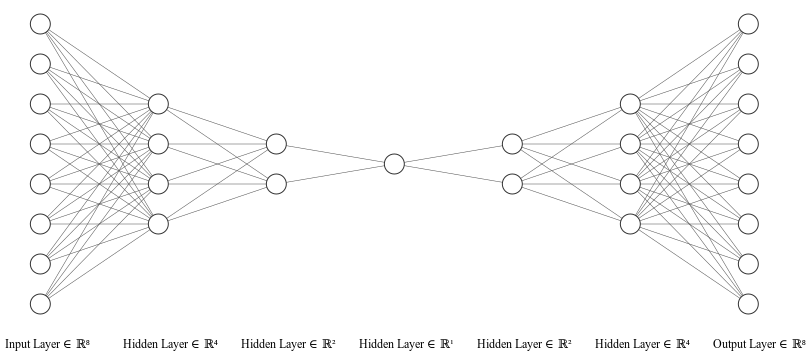
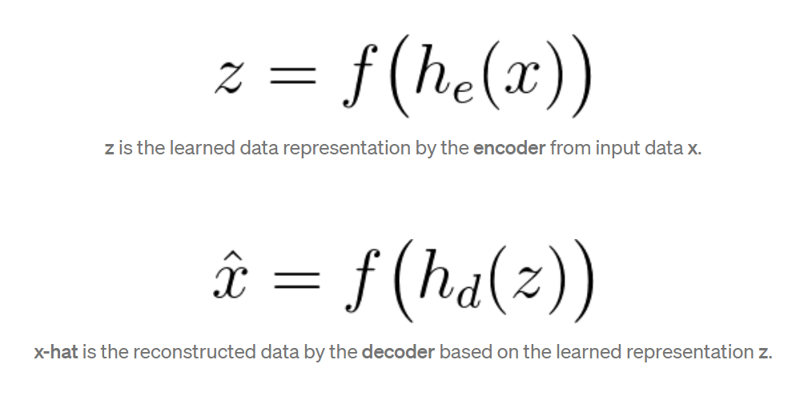

### Auto Encoder Notes :
 - Can be used for **Feature Selection**.
 - **Find function** Mapping the **input Features** to itself, **Input Features**. < i.e Nyari fungsi yang bisa menghasilkan input feature juga.>
 
 ## Here's The architecture 
 

 ## Consist 2 Important Parts : 
 ### Encoder --> Learn *data Representation*
 ### Decoder --> *Reconstruct the data based on the **Latent Space** , Extracted Features

The formula of the Encoder and decoder :

- As You can see , it's just A Mapping Function.

#### So what's Encoder :
- Learn **How** the data is represented, i.e the distribution :)

#### So what's Decoder :
- Create the reconstructed input features To Calculate the loss.

#### How it's learn ? 
- Doing back propagation and **comparing** the reconstructed **x-hat** and the original data **x**.
- Using the Mean-squared-error as the loss function

